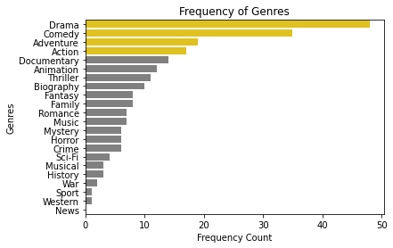
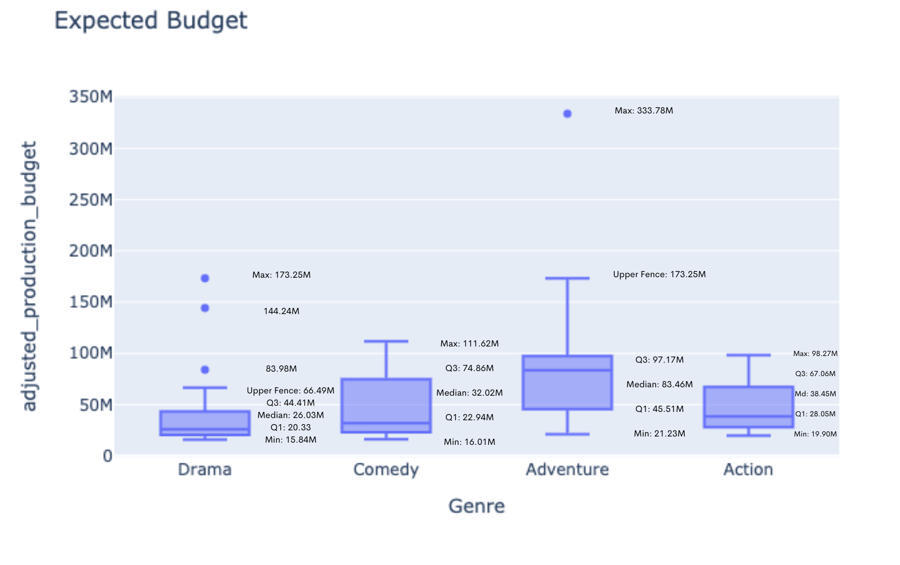
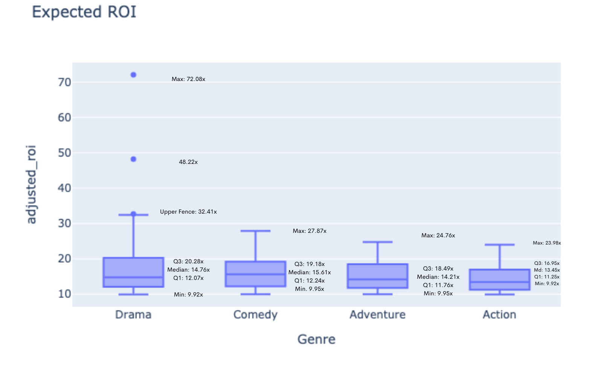

# Microsoft Film Studios Debut - Movie Analysis & Recommendations 
This project conducts a quantitative analysis of the most profitable films in the past century, focusing on return on investment with a major studio budget (15M USD+). Results reflect films' budgets accounted for inflation from their initial release date, the expectations for Microsoft's ROI, and the calculated budget needed to launch an initial blockbuster. 

We will be working with data from the following sources:
1. IMDb - Title Basics 
2. tn (The Numbers) - Movie Budgets

The CSV files used for the analysis can be found in the ```zipped_data``` folder.

The analysis revealed three business recommendations/findings Microsoft could implement and expect with the debut of MS Studios and are listed below:

1. The movie genre should be one of the following:
    1. Drama
    2. Adventrue
    3. Comedy 
    4. Action
2. The movie will cost around the following:
    1. Drama - 26M USD
    2. Adventrue - 83M USD
    3. Comedy - 32M USD
    4. Action - 39M USD
3. The expected return on investment:
    1. Drama - 14.7x
    2. Adventrue - 14.2x
    3. Comedy - 15.6x
    4. Action - 13.5x
    
The analysis was performed using python and the code and be found in ```Main Notebook.ipynb```

# Business Problem
Analyzing the economic data from movies of the last century and adjusting all monetary figures to account for inflation is how we give Microsoft realistic expectations of the amount of money needed to make a blockbuster hit and how much money they could expect in return.  

We will be looking at the most profitable genre of movies, expected budgetary needs, and expected ROI.

As mentioned, the analysis was narrowed to films with a 15M USD+ budget. A rare number of movies with lower budgets (cult classics) reflect higher ROIs; however, these movies have less box office sales and thus are misleading and should be treated as outliers.

# Data

The data used in this analysis was provided by Flatiron School and came from IMDb (Internet Movie Data Base) & tn (The Numbers). The following libraries were leveraged to perform the analysis ```Glob, Plotly, Pandas, NumPy, matplotlib, Seaborn & CPI```.

Initial analysis was performed on the 'movie_budgets.csv'  file to assess the financials of all the movies for the previous 100 years. After that, all monetary values were adjusted for inflation to understand better the financial commitment needed to produce a debut blockbuster film.

The data was then sorted by return on investment and modified to reflect only movies with budgets over 15 million USD. This was done to show the top 100 most profitable movies, except for low-budget films, as cult classics are usually outliers in the indie film industry, and their return on investment is disproportionate to other films.
Data from title_basics.csv was then used to assign a genre to each of the top movies. 

Once the data frames reflected the genre data, we examined the frequency of each genre and complied a list of the top four most popular genres from the most profitable studio-budget films.

Lastly, we examined each genre individually to acquire a mean for the project's budget & expected ROI.

# Results

## The most popular genres are Drama, Comedy, Adventure & Action


<div>

</div>

The plot shows us the 4 most popular movie genre for the most profitable studio-budget movies of the past century 

**We recommend Microsoft target one of these four genres in their upcoming film debut**

We also analyzed the what the expeected budgetary needs Microsoft will have to finance their studio film debut


**We recommend Microsoft go with the most popular genre which also happens to be the most economical: Drama**

<div>

</div>

Lastly, we analyzed the ROI metrics for each genre, as the plot shows below.


**Per analysis we can recommend Microsoft's financial officer can expect an ROI of: 14.76x**

<div>

</div>
